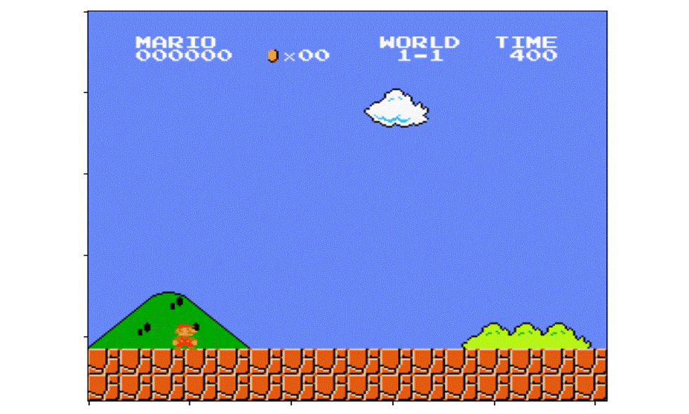
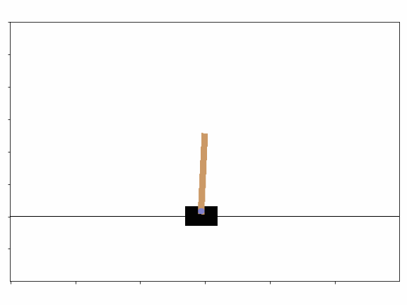
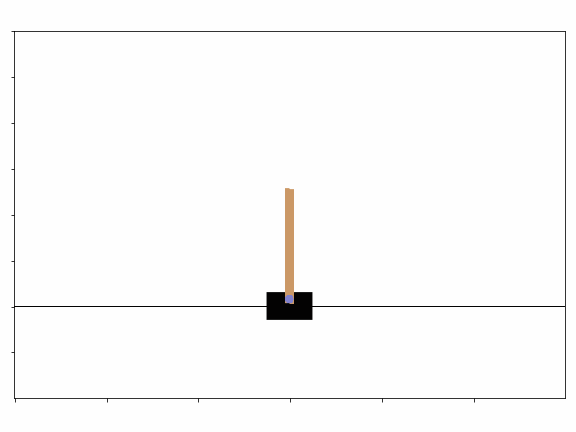
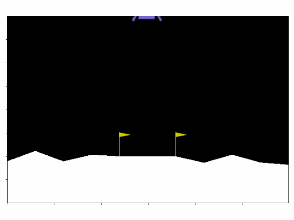

# MarioDQN

Read this in other languages: [English](./README.md), [Русский](./README.ru.md)

## Goal of the project:
1) Creating a neural net that uses Reinforcement Learning Algorithm to learn how to play Mario game

## Contributors:
1) [Arseny Khlytchiev](https://github.com/arseniyx92)
2) [Egor Yukhnevich](https://github.com/Straple)
3) [Vladislav Artyukhov](https://github.com/Vladislav0Art)
4) [Dmitry Artyukhov](https://github.com/dmitrii-artuhov)
5) [Artem Brezhnev](https://github.com/brezhart)

## Project presentation:
We used this presentation at HSE projects presentations:

[MarioDQN Presentation (rus)](https://docs.google.com/presentation/d/100cYpMxiK1RL7NthUdf9kef2058ZmRucG2jnOdevoAM/edit?usp=sharing)

## Google Colab:
1) [code for visualization](https://colab.research.google.com/drive/1Zs_JpAHJzPyYjarq5cz_5qTQ91pnbAGl#scrollTo=f7jhFGIpt1uf)
2) [code for plotting](https://colab.research.google.com/drive/10QMhwJ8rYr7qJr205R7IX4qAdHXD9g4E?usp=sharing)
3) [core of the DQN](https://colab.research.google.com/drive/1fNQChQLkYN1QIvSSMlRks-M7TPi1uelM?usp=sharing)

# About the project
## What we seized from the project:
Approximately no one of us have ever struggled with such ML problems before. And the whole DeepLearning was an untouched story for our team. Before the camp began, as we were told the topic of our project, we started working on it. We read articles, watched videos about ML and neural networks, learned math, that would probably help us on our DL way. And also Arseniy has coded a neural network in pure C++.

It may be said we already learned the ropes of the topic as we went to the camp and we were ready to start our prolific way on this steep learning curve. For sure we didn’t know all the tricks and lanes of this enormous topic. Anyway our tutor (Dmitri Ivanov) had a huge pile of exercises for us to receive, and due to them we managed to learn these nuances and options of Python by the way. It was quite hard to make a really convincing project in all of it’s alacrity considering the fact that for all of our teammates Python was a brand new programming language because our main one was C++ (and it remains to be our most adorable one), but anyway we strived as much as we could.

We have got a huge chunk of experience in teamwork and in ML basics in the camp, on the basement of which  we now can create our own ML projects. In addition to this we have met a big number of interesting people who have their own goals and desires in IT.

## Results
1)We managed to teach the agent to play mario quite well and now he can pass a worthwhile part of the level, that may be without any doubts called as a prosperous result.
2)Everyone in our team received invaluable experience in team work.
3)We have learned the ropes and ML basics, according to which we’re going to work on similar projects.

### Best Mario agent's play:

### Agent plays in simpler games:

#### Cartpol game

Initial stage of learning:

Final stage of learning:

#### Lunar Lander game:

Initial stage of learning:

Final stage of learning:

