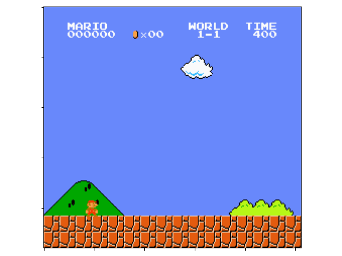
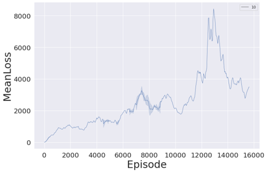
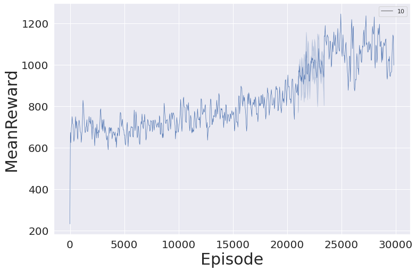

# MarioDQN

Read this in other languages: [English](./README.md), [Русский](./README.ru.md)


## Goal of the project:
1) Creating a neural net that uses Reinforcement Learning Algorithm to learn how to play Mario game

## Contributors:
1) [Arseny Khlytchiev](https://github.com/arseniyx92)
2) [Egor Yukhnevich](https://github.com/Straple)
3) [Vladislav Artyukhov](https://github.com/Vladislav0Art)
4) [Dmitry Artyukhov](https://github.com/dmitrii-artuhov)
5) [Artem Brezhnev](https://github.com/brezhart)

## Project presentation:
We used this presentation at HSE projects presentations:

[MarioDQN Presentation (rus)](https://docs.google.com/presentation/d/100cYpMxiK1RL7NthUdf9kef2058ZmRucG2jnOdevoAM/edit?usp=sharing)


## Google Colab:
1) [Code for visualization](https://colab.research.google.com/drive/1Zs_JpAHJzPyYjarq5cz_5qTQ91pnbAGl#scrollTo=f7jhFGIpt1uf)
2) [Code for plotting](https://colab.research.google.com/drive/10QMhwJ8rYr7qJr205R7IX4qAdHXD9g4E?usp=sharing)
3) [Core of the DQN](https://colab.research.google.com/drive/1fNQChQLkYN1QIvSSMlRks-M7TPi1uelM?usp=sharing)

# About the project

## What we have learned from the project:

No one of us have ever struggled with such ML problems before. And the whole Deep Learning was an untouched story for our team. Before the camp began, as we were told the topic of our project, we started working on it. We read articles, watched videos about ML and neural networks, learned math, that would probably help us on our DL way. And also Arseny has coded a neural network in pure C++.

It may be said we already learned the basics of the topic as we went to the camp and we were ready to start dive into the developing. For sure we did not know all the tricks and lanes of this enormous topic. Anyway our tutor [Dmitry Ivanov](https://t.me/dimonenka) had a huge pile of exercises for us, and due to them we managed to learn these nuances and options of Python by the way. It was quite hard to make a really elaborate project considering the fact that for all of our teammates Python was a brand new programming language because our main one was C++ (and it remains to be our most adorable one), but anyway we have strived as much as we could.

We have got a huge amount of experience in teamwork and in ML basics in the camp, on the basement of which we now can create our own ML projects. In addition to this we have met many interesting people who have their own goals and desires in IT.

## Results:

1)  We managed to teach the agent to play mario quite well and now it can pass a worthwhile part of the level, that may be called without any doubts as a prosperous result.

2)  Everyone in our team received invaluable experience in teamwork.

3)  We have learned the ML basics, according to which we’re going to work on similar projects.


### Best Mario agent's play:



### Agent plays simpler games:

#### Cartpol game:

Initial stage of learning:


Final stage of learning:


#### Lunar Lander game:

Initial stage of learning:


Final stage of learning:


## Reinforcement Learning Algorithm:


1)	The agent performs an action in the environment depending on the current state and receives a reward 
2)	The environment goes to the next state
3)	The agent takes action again and receives a reward
4)	Actions are repeated until the agent enters a terminal state (for example, death in the game)

The main goal of the agent is to maximize the amount of rewards for the entire episode. Episode is the period from the start of the game to the terminal state.

A feature of reinforcement learning is the lack of data for training, so the agent trains on the data that it receives by interacting with the environment.


## What is Q-learning?

Q-training is a model that trains some utility function – Q-function. This function, based on the current state and specific action, calculates the predicted reward for the entire episode – Q value.

The agent performs actions based on its policy. Policy is the rules that determine what next action the agent will perform.
The policy of our agent is called *Epsilon-Greedy*: with some probability the agent performs a random action, otherwise it performs an action that corresponds to the maximum value of the Q-function.

```
# implementation of Epsilon-Greedy Policy:

def act(state):
    rand_float = random.random() # returns random float in range: [0, 1)
    if rand_float <= EPS:
        action = random_action()
    else:
        action = model.get_action(state) # returns action that brings max Q-value

    return action

```
In the classical implementation of the Q-learning algorithm, a table is formed from all possible states of the environment and all possible actions. The task is to calculate the Q-values ​​for each pair (state, action).


### Learning process:

We add to the considered value of the Q-function the difference between the optimal value and the current value of this function.

1)  *Q(s, a)* – Q-function value for a state and an action
2)  *Q*<sub>*target*</sub> *(s, a)* – according to our assumption, this is the optimal value of the Q-function, to which we are trying to bring closer the current value of the Q-function
3)  *s<sub>t</sub>, a<sub>t</sub>* – the state of the environment and the selected action at a point in time $t$
4)  *r<sub>t</sub> (s<sub>t</sub>, a<sub>t</sub>)* – reward for the current state of the environment and the taken action
5)  &gamma; – discount coefficient. It is necessary in order to diminish the "significance" of the reward at subsequent points in time
6)  &alpha; – learning rate. It determines how much we change the current value of the Q-function


## Deep Q-learning – DQN:

The environment often has too many states and actions, so it is impossible to create the table explicitly. To solve this problem, neural networks are used in order not to store utility values, but to predict them. The current state is received at the input of the neural network, and at the output it gives a predicted reward for all actions.

To change the Q-value, we update the neural network weights so that more correct values ​​are predicted. This is done, as usual, with a gradient descent.


## Experience Replay Buffer:

As mentioned earlier, a feature of this learning algorithm is the lack of data for training the model, so the agent needs to accumulate game experience and perform training based on it. While interacting with the environment, the agent accumulates transitions into a buffer. These transitions include: the current state, the action performed, the reward for the action, the next state after the action, and a variable that determines whether the current state is terminal:

```
transition = (state, action, next_state, reward, done)
replay_buffer.append(transition)
```

The advantages of this approach:
1)	Experience can be reused (the agent does not need to perform a lot of interactions with the environment)
2)	We do not forget previous experience, as we do not focus only on the actions that are being performed at the moment


## Target network:

In order for the entire learning algorithm to work, it is necessary to have a second neural network `target model`, which determines the optimal value of the Q-function (Q target). This model is a copy of the `online model` that interacts with the environment.

The only difference is that the `target model` weights are updated a little less often, we have about every 500th episode.

This is necessary for the correct training of the model. Otherwise, if the `online model` calculates the Q target function and the Q-function independently, then when the network weights change, the following values ​​of both functions will change approximately the same. Therefore, the difference between the values remains the same as well. This leads to the state where current Q-values will never be brought closer to the optimum value.


There are 2 methods for updating target model weights: hard update, soft update. The first one copies the `online model` into the `target model` for each `n`-th training iteration, in the second method the `target model` weights are also recalculated during training, but more slowly, as the weighted average of the weights of the two networks: *Q*<sub>*target*</sub> := *Q*<sub>*target*</sub> + &alpha; (*Q*<sub>*agent*</sub> - *Q*<sub>*target*</sub>)


## Dueling DQN:

Dueling DQN is a modification to the regular DQN model. The main idea is to calculate with a network not the Q values ​​for all actions, but separately calculate the weighted average value of the Q function for all actions (the so-called *V value*), as well as
*advantages* for each action, which are defined as the difference between the Q function and the weighted average: *advantage(s, a) = Q(s, a) - V(s)* (more details [here](https://towardsdatascience.com/dueling-deep-q-networks-81ffab672751))

We launched agent training for the Dueling DQN modification and for the regular DQN. It turned out that Dueling DQN learns about 2 times faster.


## Additional functionality: Saver, Logger and Plotting, Visualization:

### Saver:

We have implemented the functionality of periodically saving the weights of the trained neural network, so that in the event of a necessary suspension of calculations in order to change the hyperparameters, we can continue training on the saved version of the network. This feature was especially useful when we ran into some *problem in agent training* (more on this later).

### Logger and Plotting:

The logging functionality was implemented: at each nth episode, we saved the calculated metrics in a file (functions of average loss and average reward per episode) in order to be able to plot graphs of these functions without interrupting the computational process.

### Visualization:

Since we have implemented the function of saving the model weights during training, we were able to restore versions of the neural network. This allowed us to build a visualization of the agent's interaction with the environment (gameplay) at different stages of training.

## Graph analysis:

We counted 2 metrics: the average loss function over the last 100 episodes (how much the average Q value differs from the Q target value), and the average reward over the last 100 episodes. Calculations were made for both models: Dueling DQN and DQN.

### Loss function:

**For Dueling DQN:** 



**Для DQN:**


At first glance, it may seem that the Dueling modification performs worse, but the high value of the function is explained by the fact that the agent who learns on Dueling DQN, on average, went further in the level than the agent with the usual training model. In this regard, the environment for the agent became unknown, and he was more likely to make mistakes.


### Reward function:

**For Dueling DQN:** 


**For DQN:**



The function of the average reward gradually increases, which indicates that agents learn more about the environment, that is, they move further down the level.

It can be seen from the graphs that the agent with the Dueling DQN training model receives on average the same reward as the agent with DQN, but the modified version took almost 2 times fewer iterations to learn how to receive the same amount of reward.

## Problems:

Since our team had not previously dealt with ML, we faced many problems as we were working on the project, but the most significant was the following: at a certain stage of the calculations, there was a problem with training the agent, Mario began to run into pipes at the level, not trying to jump over the pipes.

We believe that this behavior is due to the fact that the loss of the reward from the expiration of the time for the passage of the episode was less significant than the death of Mario when hitting the enemy. In other words, Mario *"believed"* that failing the level due to the expiration of time was more preferable for him than death.


### Punishment-optimization:

This problem really baffled us: we did not know how to "force" the agent to pass the level.

**The whole team would like to express our deep gratitude** to *Arseny Khlytchiev*, who managed to come up with and implement a modification of the reward function, called Punishment-optimization. Arseny suggested adding a negative reward for idle of Mario in order to restore the significance of the agent's movement forward in the level. This improvement had a strong impact on the behavior of the agent in the environment: the agent no longer got stuck in front of pipes, and began to avoid any downtime.


