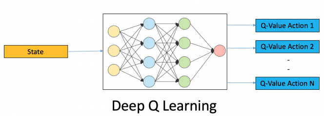

# MarioDQN

Read this in other languages: [English](./README.md), [Русский](./README.ru.md)


## Goal of the project:
1) Creating a neural net that uses Reinforcement Learning Algorithm to learn how to play Mario game

## Contributors:
1) [Arseny Khlytchiev](https://github.com/arseniyx92)
2) [Egor Yukhnevich](https://github.com/Straple)
3) [Vladislav Artyukhov](https://github.com/Vladislav0Art)
4) [Dmitry Artyukhov](https://github.com/dmitrii-artuhov)
5) [Artem Brezhnev](https://github.com/brezhart)

## Project presentation:
We used this presentation at HSE projects presentations:

[MarioDQN Presentation (rus)](https://docs.google.com/presentation/d/100cYpMxiK1RL7NthUdf9kef2058ZmRucG2jnOdevoAM/edit?usp=sharing)


## Google Colab:
1) [code for visualization](https://colab.research.google.com/drive/1Zs_JpAHJzPyYjarq5cz_5qTQ91pnbAGl#scrollTo=f7jhFGIpt1uf)
2) [code for plotting](https://colab.research.google.com/drive/10QMhwJ8rYr7qJr205R7IX4qAdHXD9g4E?usp=sharing)
3) [core of the DQN](https://colab.research.google.com/drive/1fNQChQLkYN1QIvSSMlRks-M7TPi1uelM?usp=sharing)

# About the project
## What we seized from the project:
Approximately no one of us have ever struggled with such ML problems before. And the whole DeepLearning was an untouched story for our team. Before the camp began, as we were told the topic of our project, we started working on it. We read articles, watched videos about ML and neural networks, learned math, that would probably help us on our DL way. And also Arseniy has coded a neural network in pure C++.

It may be said we already learned the ropes of the topic as we went to the camp and we were ready to start our prolific way on this steep learning curve. For sure we didn’t know all the tricks and lanes of this enormous topic. Anyway our tutor (Dmitri Ivanov) had a huge pile of exercises for us to receive, and due to them we managed to learn these nuances and options of Python by the way. It was quite hard to make a really convincing project in all of it’s alacrity considering the fact that for all of our teammates Python was a brand new programming language because our main one was C++ (and it remains to be our most adorable one), but anyway we strived as much as we could.

We have got a huge chunk of experience in teamwork and in ML basics in the camp, on the basement of which  we now can create our own ML projects. In addition to this we have met a big number of interesting people who have their own goals and desires in IT.

## Results
1)  We managed to teach the agent to play mario quite well and now he can pass a worthwhile part of the level, that may be without any doubts called as a prosperous result.

2)  Everyone in our team received invaluable experience in team work.

3)  We have learned the ropes and ML basics, according to which we’re going to work on similar projects.


### Best Mario agent's play:


### Agent plays simpler games:

#### Cartpol game

Initial stage of learning:


Final stage of learning:


#### Lunar Lander game:

Initial stage of learning:


Final stage of learning:


## Reinforcement Learning Algorithm:


1)	The agent performs an action in the environment depending on the current state and receives a reward 
2)	The environment goes to the next state
3)	The agent takes action again and receives a reward
4)	Actions are repeated until the agent enters a terminal state (for example, death in the game)

The main goal of the agent is to maximize the amount of rewards for the entire episode. Episode is the period from the start of the game to the terminal state.

A feature of reinforcement learning is the lack of data for training, so the agent trains on the data that it receives by interacting with the environment.


## What is Q-learning?

Q-training is a model that trains some utility function – Q-function. This function, based on the current state and specific action, calculates the predicted reward for the entire episode – Q value.

The agent performs actions based on its policy. Policy is the rules that determine what next action the agent will perform.
The policy of our agent is called *Epsilon-Greedy*: with some probability the agent performs a random action, otherwise it performs an action that corresponds to the maximum value of the Q-function.

```
# implementation of Epsilon-Greedy Policy:

def act(state):
    rand_float = random.random() # returns random float in range: [0, 1)
    if rand_float <= EPS:
        action = random_action()
    else:
        action = model.get_action(state) # returns action that brings max Q-value

    return action

```
In the classical implementation of the Q-learning algorithm, a table is formed from all possible states of the environment and all possible actions. The task is to calculate the Q-values ​​for each pair (state, action).


### Learning process:

We add to the considered value of the Q-function the difference between the optimal value and the current value of this function.

1)  *Q(s, a)* – Q-function value for a state and an action
2)  *Q*<sub>*target*</sub> *(s, a)* – according to our assumption, this is the optimal value of the Q-function, to which we are trying to bring closer the current value of the Q-function
3)  *s<sub>t</sub>, a<sub>t</sub>* – the state of the environment and the selected action at a point in time $t$
4)  *r<sub>t</sub> (s<sub>t</sub>, a<sub>t</sub>)* – reward for the current state of the environment and the taken action
5)  &gamma; – discount coefficient. It is necessary in order to diminish the "significance" of the reward at subsequent points in time
6)  &alpha; – learning rate. It determines how much we change the current value of the Q-function


## Deep Q-learning – DQN:

The environment often has too many states and actions, so it is impossible to create the table explicitly. To solve this problem, neural networks are used in order not to store utility values, but to predict them. The current state is received at the input of the neural network, and at the output it gives a predicted reward for all actions.

To change the Q-value, we update the neural network weights so that more correct values ​​are predicted. This is done, as usual, with a gradient descent.





## Experience Replay Buffer:

As mentioned earlier, a feature of this learning algorithm is the lack of data for training the model, so the agent needs to accumulate game experience and perform training based on it. While interacting with the environment, the agent accumulates transitions into a buffer. These transitions include: the current state, the action performed, the reward for the action, the next state after the action, and a variable that determines whether the current state is terminal:

```
transition = (state, action, next_state, reward, done)
replay_buffer.append(transition)
```

The advantages of this approach:
1)	Experience can be reused (the agent does not need to perform a lot of interactions with the environment)
2)	We do not forget previous experience, as we do not focus only on the actions that are being performed at the moment


## Target network:

In order for the entire learning algorithm to work, it is necessary to have a second neural network `target model`, which determines the optimal value of the Q-function (Q target). This model is a copy of the `online model` that interacts with the environment.

The only difference is that the `target model` weights are updated a little less often, we have about every 500th episode.

This is necessary for the correct training of the model. Otherwise, if the `online model` calculates the Q target function and the Q-function independently, then when the network weights change, the following values ​​of both functions will change approximately the same. Therefore, the difference between the values remains the same as well. This leads to the state where current Q-values will never be brought closer to the optimum value.


There are 2 methods for updating target model weights: hard update, soft update. The first one copies the `online model` into the `target model` for each `n`-th training iteration, in the second method the `target model` weights are also recalculated during training, but more slowly, as the weighted average of the weights of the two networks: *Q*<sub>*target*</sub> := *Q*<sub>*target*</sub> + &alpha; (*Q*<sub>*agent*</sub> - *Q*<sub>*target*</sub>)

