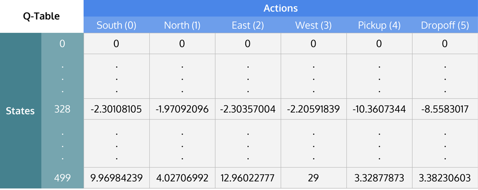

# MarioDQN

Читать это на другом языке: [English](./README.md), [Русский](./README.ru.md)


## Цель проекта:
Создать нейронную сеть, которая использует алгоритм обучения с подкреплением (*Reinforcement Learning Algorithm*), чтобы научиться играть в Mario.


## Участники:
1) [Арсений Хлытчиев](https://github.com/arseniyx92)
2) [Егор Юхневич](https://github.com/Straple)
3) [Владислав Артюхов](https://github.com/Vladislav0Art)
4) [Дмитрий Артюхов](https://github.com/dmitrii-artuhov)
5) [Артем Брежнев](https://github.com/brezhart)

## Презентация проекта:
Мы использовали данную презентацию при выступлении на недельной смене по "Программированию и анализу данных" от [Высшей школы экономики](https://spb.hse.ru/).

[MarioDQN Презентация](https://docs.google.com/presentation/d/100cYpMxiK1RL7NthUdf9kef2058ZmRucG2jnOdevoAM/edit?usp=sharing)


# О проекте

## Что мы извлекли из проекта:

## Результаты:


### Игра агента в марио:


### Игра агента в более простые игры:


## Алгоритм обучения с подкреплением — Reinforcement Learning:


1)	Агент совершает в среде действие в зависимости от текущего состояния и получает награду 
2)	Среда переходит в следующее состояние 
3)	Агент опять совершает действие и получает награду
4)	Действия повторяются, пока агент не попадет в терминальное состояние (например, смерть в игре)

Основная цель агента заключается в максимизации суммы наград за весь эпизод — период от старта игры до терминального состояния.

Особенностью обучения с подкреплением является отсутсвие данных для тренировки, поэтому агент тренируется на данных, которые получает, взаимодействуя со средой.


## Что такое Q-learning:

Q-learning – это модель, которая обучает некоторую функцию полезности – Q-функцию. Эта функция на основании текущего состояния и конкретного действия вычисляет прогнозируемую награду за весь эпизод – Q value.

Агент совершает действия на основании своей политики – правила, которые определяют какое следующее действие выполнит агент. 
Политика нашего агента называется *Epsilon-Greedy*: с некоторой вероятностью агент совершает случайное действие, иначе он совершает действие, которое соответствует максимальному значению Q-функции.

```
# realization of Epsilon-Greedy Policy:

def act(state):
    rand_float = random.random() # returns random float in range: [0, 1)
    if rand_float <= EPS:
        action = random_action()
    else:
        action = model.get_action(state) # returns action that brings max Q-value

    return action

```

В классической реализации алгоритма Q-learning формируется таблица из всех возможных состояний среды и всех возможных действий. Задача заключается в том, чтобы посчитать значения Q-values для каждой пары (состояние, действие).




### Процесс обучения:

Мы добавляем к рассматриваемому значению Q-функции разность между оптимальным значением и текущим значением данной функции. 

1)  Q(s, a) – значение Q-функции для состояния и действия
2)  Q<sub>target</sub> (s, a) – это оптимальное, по нашему предположению, значение Q функции, к которому мы пытаемся свести текущее значение Q функции
3)  s<sub>t</sub>, a<sub>t</sub> – состояние среды и выбранное действие в момент времени $t$
4)  r<sub>t</sub> (s<sub>t</sub>, a<sub>t</sub>) – награда за текущее состояние среды и совершенное действие
5)  &gamma; – коэффициент дисконтирования. Он необходим для того, чтобы уменьшать "значимость" награды в последующих моментах времени
6)  &alpha; – коэффициент обучения. Он определяет насколько сильно мы изменим текущее значение Q-функции


## Deep Q-learning – DQN:

Часто среда имеет слишком много состояний и действий, поэтому составить таблицу в явном виде невозможно. Для решения данной проблемы используют нейронные сети, чтобы не хранить значения полезности, а предсказывать их. На вход нейросети поступает текущее состояние, а на выход она дает прогнозируемую награду для всех действий.

Для изменения Q-value мы обновляем параметры нейронной сети, чтобы предсказывались более правильные значения. Делается это, как обычно, градиентным спуском.


## Experience Replay Buffer:

Как было сказано ранее, особенностью данного алгоритма обучения является отсутсвие данных для тренировки модели, поэтому агенту необходимо накапливать игровой опыт и производить обучение, основываясь на нем. Во время взаимодействия со средой агент накапливает переходы в некоторый буфер. Эти переходы включают в себя: текущее состояние, произведенное действие, награда за действие, следующее состояние после действия, а также переменную, определяющую, является ли текущее состояние терминальным:

```
transition = (state, action, next_state, reward, done)
replay_buffer.append(transition)
```

Преимущества данного подхода:
1)	Можно переиспользовать опыт (не нужно много взаимодействий со средой)
2)	Мы не забываем предыдущий опыт, так как не фокусируемся только на действиях, производимых в текущий момент.


## Target network:

Для того, чтобы весь алгоритм обучения работал необходимо иметь вторую нейронную сеть `target model`, которая определяет оптимальное значение Q-функции (Q target) и является копией взаимодействующей со средой модели `online model`. Единственное отличие заключатеся в том, что веса `target model` обновляются несколько реже, у нас примерно каждый 500-ый эпизод. Это нужно для корректного обучения модели, так как в ином случае если `online model` будет производить вычисления Q target и Q функций самостоятельно, то при изменении весов сети следующие значения Q target и Q функций изменятся примерно одинаково, то есть разница между ними останется такой же, и мы не будет сводиться к оптимальному значению.

Существуют 2 метода обновления весов `target model`: `hard update`, `soft update`. Первый копирует `online model` в `target model`  каждую `n`-ую итерацию обучения, а во втором методе веса `target model` также пересчитываются при обучении, но медленнее, как взвешенное среднее весов двух сетей: *Q*<sub>*target*</sub> := *Q*<sub>*target*</sub> + &alpha; (*Q*<sub>*agent*</sub> - *Q*<sub>*target*</sub>)


## Dueling DQN:

Dueling DQN – это модификация для обычной модели DQN. Основная идея заключается в том, чтобы сеткой просчитывать не значения Q для всех действий, а считать отдельно средневзвешенное значение Q функции по всем действиям (так называемое *V value*), а также *преимущества* для каждого действия, которые определяются как разность между Q функцией и средневзвешенным значением: *advantage(s, a) = Q(s, a) - V(s)* (подробнее [здесь](https://towardsdatascience.com/dueling-deep-q-networks-81ffab672751))

Мы запускали тренировки агентов для модификации Dueling DQN и для обычного DQN. Получилось, что Dueling DQN обучается примерно в 2 раза быстрее.


## Дополнительный функционал: Saver, Logger and Plotting, Visualization:

### Saver:

Мы реализовали функционал периодического сохранения весов обучаемой нейронной сети, чтобы в случае необходимого приостановления расчетов с целью изменения гиперпараметров иметь возможность продолжить обучение на сохраненной версии сети. Данная возможность была особенно полезна, когда мы столкнулись с некоторой *проблемой в обучении агента* (о ней более подробно позже).

### Logger and Plotting:

Был реализован функционал логирования: на каждом n-том эпизоде мы сохраняли вычисляемые метрики в файле (функции средней потери и средней награды за эпизод), чтобы иметь возможность строить графики этих функций, не прерывая вычислительный процесс.

### Visualization:

Благодаря функции сохранения весов модели во время обучения, мы имели возможность восстанавливать версии нейронной сети. Это позволило нам строить визуализацию взаимодействия агента со средой (игровой процесс) на разных стадиях обучения.


## Анализ графиков:

Мы считали 2 метрики: среднюю функцию потери за последние 100 эпизодов (то, насколько в среднем отличается Q value от Q target value), а также среднюю награду за последние 100 эпизодов. Расчеты были произведены как для Dueling DQN, так и для DQN.

### Функция потери:

**Для Dueling DQN:** 


**Для DQN:**


На первый взгляд может показаться, что Dueling модификация показывает себя хуже, однако большое значение функции потери объясняется тем, что агент, обучающийся на Dueling DQN в среднем проходил дальше по уровню, чем агент с обычной моделью обучения. В связи с этим среда для агента становилась неизвестной, и он чаще ошибался.


### Функция награды:

**Для Dueling DQN:** 


**Для DQN:**


Функция средней награды постепенно возрастает, это свидетельствует о том, что агенты узнают о среде больше, то есть проходят дальше по уровню.

Из графиков видно, что агент с моделью обучения Dueling DQN в среднем получает такую же награду, что агент с DQN, однако модифицированной версии понадобилось практически в 2 раза меньше итераций, чтобы научиться получать такое среднее количество награды.


## Проблемы:

Так как наша команда ранее не занималась ML, мы столкнулись со множеством проблем по мере разработки, однако самая весомая заключалась в следующем: на определенном этапе вычислений возникла проблема с обучением агента, Марио начал упираться в трубы на уровне, не пытаясь их перепрыгивать. 

Мы считаем, что данная особенность поведения связана с тем, что потеря награды от исхода времени на прохождение эпизода была менее значительна, чем смерть Марио при ударе с врагом. Другими словами, Марио *"считал"*, что завершить уровень по причине истечения времени для него более предпочтительно нежели смерть.

### Punishment-оптимизация:

Данная проблема действительно поставила нас в тупик: мы не знали как "заставить" агента проходить уровень.

**Всей командой выражаем огромную благодарность** *Арсению Хлытчиеву*, который сумел придумать и реализовать модификацию функции награды, названную **Punishment-оптимизация**. Арсений предложил добовлять отрицательную награду за *"простой"* Марио, чтобы восстановить значимость передвижения агента вперед по уровню. Данное улучшение оказало сильное влияние на поведение агента в среде: агент более не *"застревал"* перед трубами, и начал избегать какого-либо *"простоя"*.


### Проблема:


### Punishment-оптимизация:


